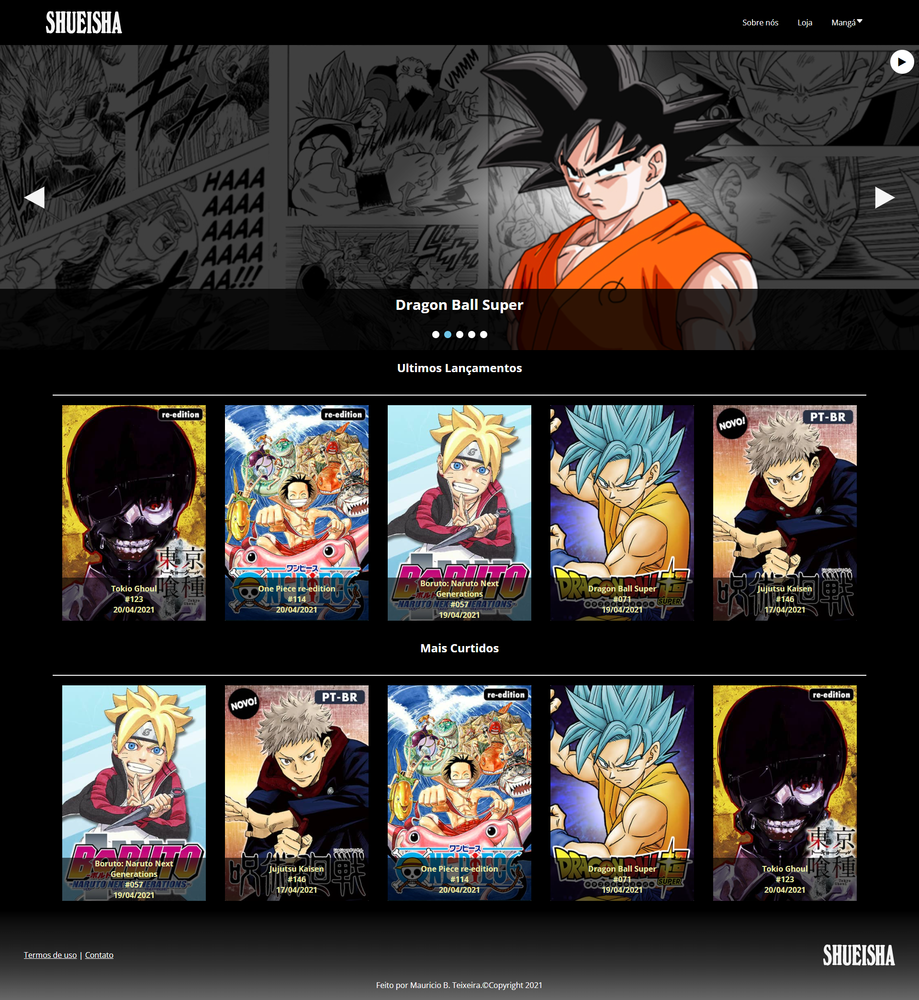
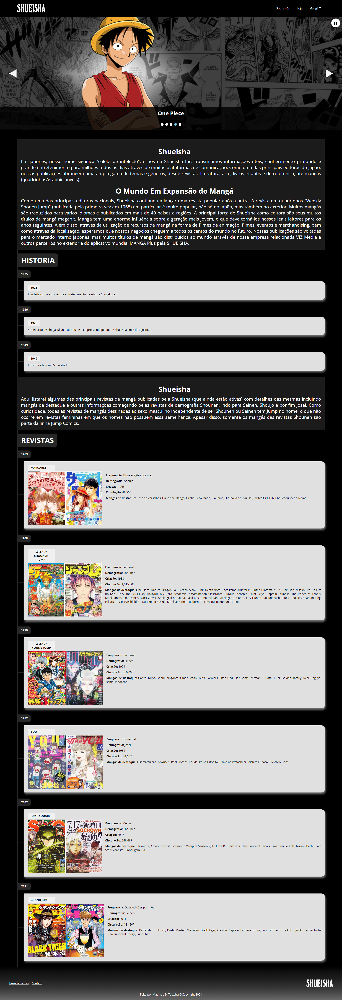

<p align="center">

  
  
  
    
    
 
</p>

<h4 align="center"> 
	🚧  Website Shueisha ♻️ Em desenvolvimento... 🚀 🚧
</h4>

<h4 align="center"> 
  Disponivel em: <a href="https://mauricio-projeto.netlify.app/">Shueisha-Home</a>
</h4>

<p align="center">
 <a href="#-sobre-o-projeto">Sobre</a> •
 <a href="#-funcionalidades">Funcionalidades</a> •
 <a href="#-layout">Layout</a> • 
 <a href="#-como-executar-o-projeto">Como executar</a> • 
 <a href="#-tecnologias">Tecnologias</a> • 
 <a href="#-autor">Autor</a> • 
 <a href="#user-content--licença">Licença</a>
</p>


## 💻 Sobre o projeto

♻️ Website Shueisha - é uma proposta de re-estruturação do website da editora de mangás, Shueisha.

Projeto desenvolvido durante **A Jornada #kick** organizado pela [#Kick](http://soukick.com.br/).

---

## ⚙️ Funcionalidades

- [x] Os usuários podem ver conteúdos da editora Shueisha como:
  - [x] Resumos de mangás
  - [x] Principais personagens de cada mangá
  - [x] Músicas e videos relacionados ao mangá
  - [x] Conteudos relacionados
  - [x] Ler alguns capitulos do mangá na plataforma Manga Plus

- [x] Os usuários conseguem ver toda a história da shueisha e também suas principais revistas.
- [x] E também podem simular uma compra de alguns produtos relacionados às produções da editora Shueisha.

---

## 🎨 Layout

### Web

<p align="center" style="display: flex; align-items: flex-start; justify-content: center;">
  

  
  
  
  
  
</p>

---

## 🚀 Como executar o projeto

### Pré-requisitos

Antes de começar, você vai precisar ter instalado em sua máquina as seguintes ferramentas:
[Git](https://git-scm.com). 
Além disto é bom ter um editor para trabalhar com o código como [VSCode](https://code.visualstudio.com/)

Instale a extensão Live Server no Visual Studio:
      Name: Live Server
      Id: ritwickdey.liveserver
      Description: Launch a development local Server with live reload feature for static & dynamic pages
      Version: 5.6.1
      Publisher: Ritwick Dey
      VS Marketplace Link: https://marketplace.visualstudio.com/items?itemName=ritwickdey.LiveServer

#### 🧭 Rodando a aplicação web (Frontend)

```bash

# Clone este repositório
$ git clone git@github.com:m-brito/novo-website-shueisha-poc.git

# Acesse a pasta do projeto no seu terminal/cmd
$ cd novo-website-shueisha-poc

# Execute o arquivo 'index.html' no live server

```

---

## 🛠 Tecnologias

As seguintes ferramentas foram usadas na construção do projeto:

#### **Website**  (HTML, CSS, Java Script)

---


## 🦸 Autor

[](https://www.linkedin.com/in/mauricio-teixeira-37a932196/)

---

## 📝 Licença

Este projeto esta sobe a licença [MIT](./LICENSE).

Feito por Mauricio Teixeira 👋🏽 [Entre em contato!](https://www.linkedin.com/in/mauricio-teixeira-37a932196/)

---
